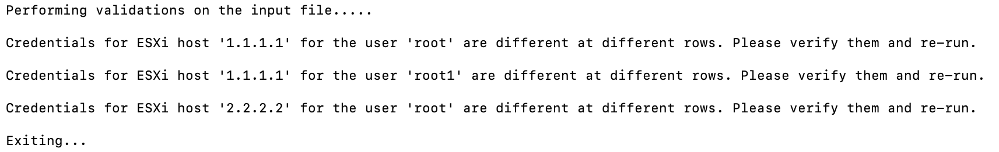
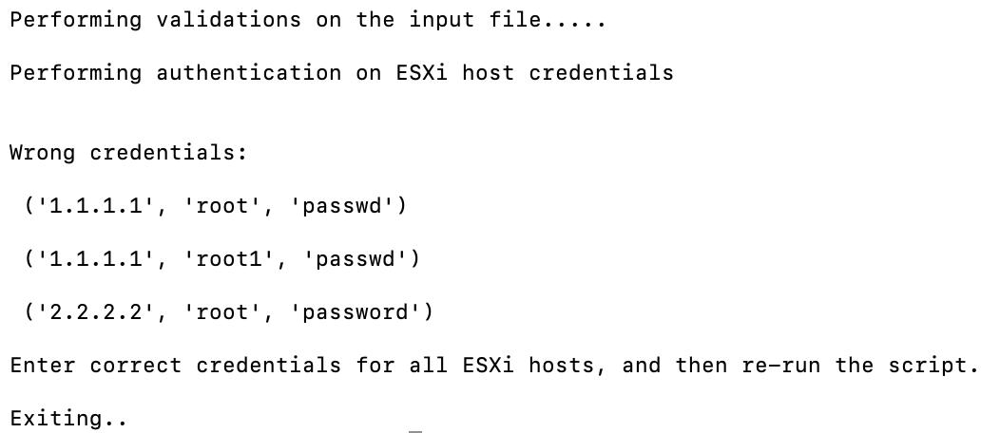
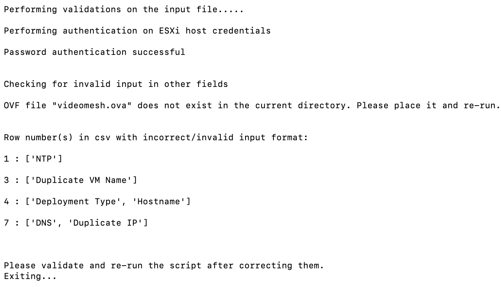
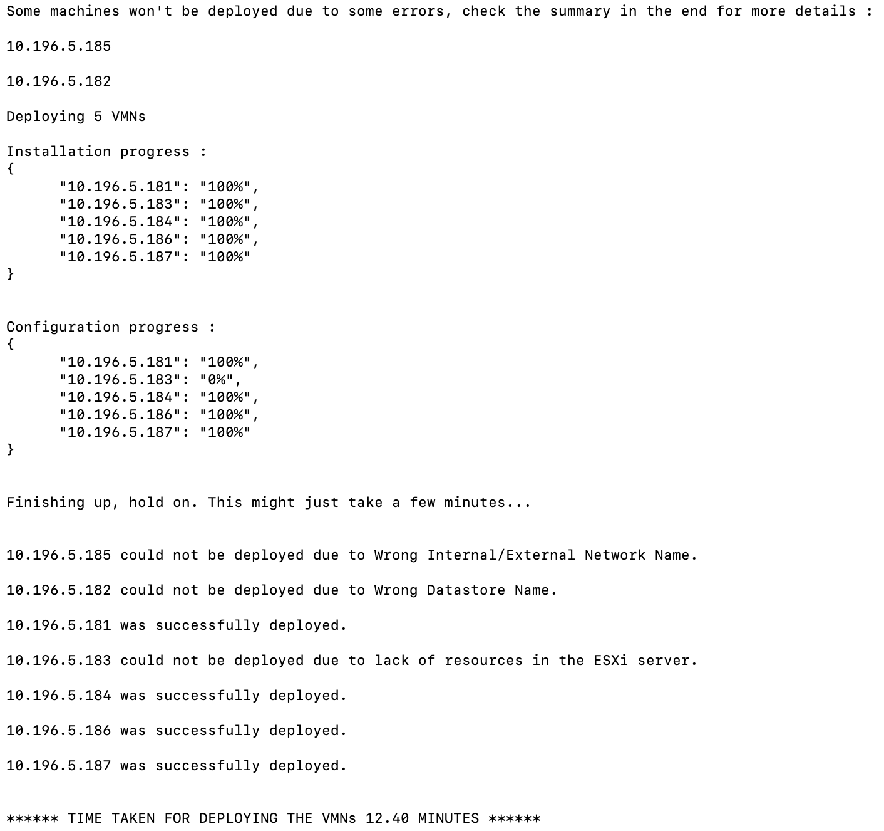

<h1 align = "center">Bulk Provisioning of Video Mesh Nodes </h1>

## **Introduction**  
Video mesh customers with substantial number of Video Mesh deployments are finding it difficult to expand as manual provisioning of the nodes are time-consuming.  

The script will help customer admin to run automatic deployment of Video Mesh Nodes on the VMWare ESXi servers.   

The script uses the ovftool API to manage machines on the ESXi, in such a way that VMNs are brought up by multiprocessing. It enables the administrator to assign network parameters (IP, netmask, Gateway, DNS, NTP, Hostname) to the VMN as part of running the script.   

NOTE: The script supports deployment of VMNs only on standalone ESXi Hosts at the moment. It does not support deployment on ESXi which are managed by vCenter Servers.

**Versioning information**
Please refer to the wiki: https://github.com/CiscoDevNet/webex-video-mesh-node-provisioning/wiki

 

## **Pre-requisites**  
* OVA File - The Video Mesh OVA file that helps in deployment of VMN. Place this file in the same directory as the script.
* config.json - This file contains the common configurations such as ovf_filename (path), and the internal and external network settings.
* input_data.csv - This CSV file takes the ESXi server IP and Credentials, Datastore, VM Name, Network configs (IP, netmask, Gateway, 1 DNS [only IP format], 1 NTP [also takes FQDN as input], Hostname [or FQDN]), and the Deployment Type ('VMNLite' or 'CMS1000') as input. Edit this csv file to include all details of nodes to be deployed.

* Ovftool is the API used to deploy and manage Machines on ESXi servers. This needs to be installed. 
    1.	Download the ovftool for Linux or MacOS -> (https://developer.vmware.com/web/tool/4.4.0/ovf)
    2.	Create a virtual environment (venv) and activate it -> (https://docs.python.org/3/library/venv.html)
    3.	Install the ‘pip’ module
    4.	Install ovftool:  
        *	For Linux, follow this procedure:  
            * Unzip the OVF Tool
            * Add the following line to your .bashrc file:   
                `export PATH=$PATH:<downloaded path>/ovftool`
            * Run the .bashrc file:
                > source ~/.bashrc  
        *	For MacOS, follow this procedure:  
            * Install the ovftool through the usual application installation.  
            * Move all the files present in `Applications/VMWare OVF Tool` to the venv’s `bin` directory.  
            * Re-activate the venv.  
    5.	Install the modules:  
        >   pip install -r requirements.txt

 

## **Sample csv** 

| esxi\_host   | username | password | datastore\_name        | name      | ip          | mask          | gateway    | dns            | ntp         | hostname | esxi\_internal\_nw | esxi\_external\_nw | deployment\_option |
| ------------ | -------- | -------- | ---------------------- | --------- | ----------- | ------------- | ---------- | -------------- | ----------- | -------- | ------------------ | ------------------ | ------------------ |
| 1.1.1.1 | user     | passwd   | datastore1 | test\_vm3 | 3.3.3.3 | 5.5.5.5 | 6.6.6.6 |     7.7.7.7 | 8.8.8.8 | user1    | VM Network         | VM Network         | CMS1000            |
| 2.2.2.2 | user     | passwd   | datastore2 | test\_vm4 | 4.4.4.4 | 5.5.5.5 | 6.6.6.6 |      7.7.7.7 | 8.8.8.8 | user2    | VM Network         | VM Network         | VMNLite            |

 

## **Running the script to bulk provision VMN**

> git clone https://github.com/CiscoDevNet/webex-video-mesh-node-provisioning.git 

> cd webex-video-mesh-node-provisioning 

> python3 runner.py 

 

## **Error messages**

### **<u> Errors before deployment </u>**

If there is invalid input in the input_data.csv, like Incorrect Credentials, Blank/Invalid IP, DNS, NTP etc., or issues like Duplicate VM Name or Duplicate IP, or if the ovf file is not present in the same directory, the script will not start deploying the Video Mesh Nodes. The script will return the following format of output, stating what the wrong input was, and to run the script again after validating the wrong fields.  

 

 

---
 

 

---

 

 

---

### **<u>Errors during/after deployment</u>**

When there are other issues that can come up while the deployment of VMN is going on, then the following format of output is displayed. The nodes with wrong datastore details and wrong Internal/External Network are displayed first, and those nodes are not included in the progress indicator at all. The nodes which cannot be deployed due to lack of resources on the ESXi, will only show 0% in the Configuration Progress indicator. The appropriate messages will be displayed in the end, stating which nodes were deployed, and which could not be deployed (along with the reason for failure). 

 

 

---

 

## **Troubleshooting**

When the script completes running, there are two types of log files generated. One log file is named as “vmn_provisioning.log” which contains logs of the entire process, and the other type of log file is specific to each VMN deployment, and is named as “ovf_IP.log”, where IP corresponds to the IP address of each VMN. These logs can be investigated upon further failures of the deployment.  

 _Check that all the nodes from the CSV file deployed correctly. If some nodes did not deploy, edit the CSV file to provide the necessary information and run the script again._

 
 

